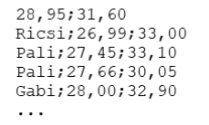
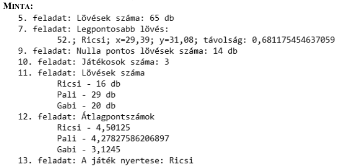

*Hungarian only text below, sorry*


# Python megoldás a Lézerlövészet feladatra 

Érdekességképpen megoldottam a 2018 őszi emelt szintű informatia érettségi
programozás részfeladatát Pythonban.

## Feladat

Egy baráti társaságban népszerű szórakozás a lézerlövészet, ahol a játékosok elektronikus
fegyverrel lőnek virtuális céltáblára. Mivel csak egy fegyverük van, így minden lövés előtt
kockadobással határozzák meg a soron következő játékost. A kockadobásban mindenki részt
vesz, így egymás után akár több lövést is leadhat egy-egy játékos.
Ebben a feladatban a lövések adataiból kell új információkat meghatároznia. A lovesek.txt
forrásállomány első sora tartalmazza a virtuális céltábla középpontjának koordinátáit (valós
értékek). A második sortól időrendben a játékosok lövéseinek az adatai találhatók. A játékos
nevét a lövésének x-y koordinátái (valós értékek) követik, az adatokat pontosvesszővel
választottuk el: 



A megoldás során vegye figyelembe a következőket:
- A program készítése során törekedjen az objektum orientált (OOP) megoldásra,
amire a feladatsor ajánlásokat is tartalmaz. Amennyiben a programot ilyen módon
nem tudja elkészíteni, akkor a feladatokat saját osztály létrehozása nélkül is
megoldhatja, de így kevesebb pontot ér a megoldása. Ebben az esetben, ha a feladat
jellemző vagy metódus létrehozását kéri, akkor Önnek saját alprogramot (függvényt,
eljárást) kell készítenie, amely paramétereken keresztül kommunikál a hívó
programmal!
- A képernyőre írást igénylő részfeladatok eredményének megjelenítése előtt írja
a képernyőre a feladat sorszámát (például: 5. feladat: )!
- Az egyes feladatokban a kiírásokat a minta szerint készítse el!
- A megoldását úgy készítse el, hogy az azonos szerkezetű, de tetszőleges input adatok
mellett is megfelelően működjön!
1. Készítsen programot a következő feladatok megoldására, amelynek a forráskódját
LezerLoveszet néven mentse el!
2. Hozzon létre saját osztályt JatekosLovese azonosítóval és definiáljon benne adattagokat
a játékos nevének és egy lövés koordinátáinak eltárolására! A lövéseket sorszámmal kell
majd ellátni, így ehhez is készítsen adattagot!
3. Készítse el az osztály konstruktorát, ami a forrásállomány egy sora alapján rögzíti a játékos
nevét, a lövés koordinátáit és a lövés sorszámát. A forrásállomány egy sora és a lövés
sorszáma legyenek a konstruktor paraméterei!
4. Olvassa be a lovesek.txt állományban található adatokat és tárolja el őket! A játékosok
lövéseit tárolja tömbben vagy listában, melynek a típusa JatekosLovese legyen!
5. Határozza meg és írja ki a minta szerint, hogy a játékosok hány lövést adtak le a játék során!
6. Készítsen Tavolsag azonosítóval valós típusú kódtagot (jellemzőt, metódust, stb.)
a JatekosLovese osztályban, mellyel meghatározza a céltábla koordinátái és a lövés
koordinátái közötti távolságot a következő algoritmus szerint:
```
változó dx: valós := CéltáblaX - LövésX;
változó dy: valós := CéltáblaY - LövésY;
térj vissza Gyök(Négyzet(dx) + Négyzet(dy))
```
A céltábla koordinátáit átadhatja a kódtag paraméterében vagy tárolhatja az osztályban
statikus típusú adattagként!

7. Határozza meg a céltábla középpontjához legközelebb eső (legpontosabb) lövés adatait és
írja ki a minta szerint! Feltételezheti, hogy csak egy ilyen lövés van!
8. Készítsen Pontszam azonosítóval valós típusú kódtagot (jellemzőt, metódust, stb.)
a JatekosLovese osztályban, mellyel meghatározza egy-egy lövés pontszámát!
A pontszámot a 10 - Tavolsag képlettel határozza meg! A pontszámot két tizedesjegyre
kell a kódtagnak kerekítenie! Negatív pontszám nem lehet, ilyenkor a kódtag nulla értékkel
térjen vissza!
9. Határozza meg és írja ki a minta szerint a nulla pontos lövések számát!
10. Számolja meg és írja ki a képernyőre a játékban részvevő játékosok számát a minta szerint!
11. Határozza meg játékosonként a leadott lövések számát! Megoldását úgy készítse el, hogy a
játékosok nevei és száma nem ismert, de feltételezheti, hogy a számuk 2 és 10 fő közötti!
12. Számítsa ki az átlagpontszámokat, majd jelenítse meg a minta szerint!
13. Határozza meg a legmagasabb átlagpontszám alapján a nyertes játékos nevét! Feltételezheti,
hogy nem alakult ki holtverseny.



*A teljes feladatleírás megtalálható a mellékelt [PDF](feladat.pdf) fájlban*

## JatekosLovese.py osztály

```
class JatekosLovese:
    # osztalyvaltozo
    lovesek = 0

    def __repr__(self):
        return ";".join([str(self.loves), self.nev, str(self.x), str(self.y)])

    def __init__(self, jatekosnev, xkoordinata, ykoordinata):
        JatekosLovese.lovesek = JatekosLovese.lovesek + 1
        self.loves = JatekosLovese.lovesek
        self.nev = jatekosnev
        self.x = xkoordinata
        self.y = ykoordinata

    def tavolsag(self, celx, cely):
        dx = celx - self.x
        dy = cely - self.y
        # gyokvonas = 0.5-dik hatvany
        return ( dx ** 2 + dy ** 2 ) ** 0.5
    
    def pontszam(self, celx, cely):
        pont = round(10 - self.tavolsag(celx,cely),2)
        if pont < 0:
            return 0
        return pont 
```

## Program forráskódja

Megtalálható a [LezerLoveszet.py](LezerLoveszet.py) fájlban

## Futási eredmény kimenet

```
5. feladat: lovesek szama
12

6. feladat: lovesek tavolsagai
{1: ['Ricsi', 2.408651074771935], 2: ['Pali', 2.1213203435596424], 3: ['Pali', 2.016581265409356], 4: ['Gabi', 1.6101242188104592], 5: ['Mizuki', 58.32831645093145], 6: ['Marci', 1.7944637081869312], 7: ['Marci', 1.8891532494744814], 8: ['Judit', 1.5133076356114752], 9: ['Ugyeske', 0.11180339887499108], 10: ['Szari', 27.64801077835438], 11: ['Szari', 4.162523273208211], 12: ['Judit', 0.5197114584074489]}

7. feladat: legjobb loves
(9, ['Ugyeske', 0.11180339887499108])

8. feladat: pontszamok
{1: ['Ricsi', 7.59], 2: ['Pali', 7.88], 3: ['Pali', 7.98], 4: ['Gabi', 8.39], 5: ['Mizuki', 0], 6: ['Marci', 8.21], 7: ['Marci', 8.11], 8: ['Judit', 8.49], 9: ['Ugyeske', 9.89], 10: ['Szari', 0], 11: ['Szari', 5.84], 12: ['Judit', 9.48]}

9. feladat: 0 pontos lovesek (db)
2

10. feladat: jatekosok szama
8

11. feladat: jatekosok loveseinek darabszama
{'Judit': 2, 'Marci': 2, 'Ugyeske': 1, 'Ricsi': 1, 'Pali': 2, 'Szari': 2, 'Mizuki': 1, 'Gabi': 1}

12. feladat: atlagos pontszam jatekosonkent
{'Judit': 8.985, 'Marci': 8.16, 'Ugyeske': 9.89, 'Ricsi': 7.59, 'Pali': 7.93, 'Szari': 2.92, 'Mizuki': 0, 'Gabi': 8.39}

13. feladat: gyoztes atlagpontszam alapjan
Ugyeske
```
